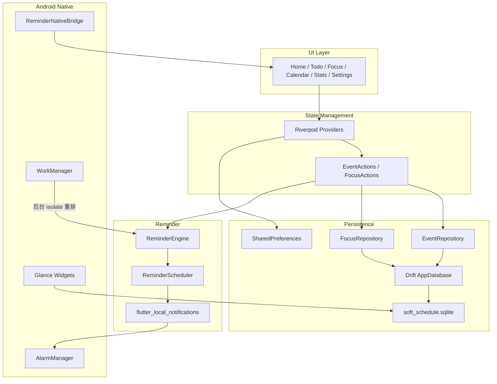

# JUJU Schedule

> A local-first schedule and task management app designed for simple planning, focused productivity, and reliable reminders.

**JUJU Schedule**（中文界面：JUJU日常）是一款本地优先的日程与待办应用。它把「今天要做什么」和「什么时候做」放在同一个产品里：时间轴上的日程、可完成的 Todo、专注计时，以及尽量准时送达的本地提醒。

很多日程工具要么偏日历、要么偏任务清单。JUJU 面向个人日常规划：创建任务要快，查看今天要清楚，提醒要能在后台真正响起来。数据保存在本机 SQLite，不需要注册账号，也不依赖云同步。

当前以 **Android** 为主要平台，版本 **2.6.7**。仓库里包含 Flutter 生成的 iOS / Windows / Linux / Web 工程，但提醒投递、桌面小组件和厂商后台适配都写在 Android 原生层，日常开发和发布也围绕 Android 进行。

官网链接：

[https://juju-d7g3aezw61b68afe8-1358899741.tcloudbaseapp.com](https://juju-d7g3aezw61b68afe8-1358899741.tcloudbaseapp.com)

Android 安装包（v2.6.7）：

[https://juju-d7g3aezw61b68afe8-1358899741.tcloudbaseapp.com/downloads/JUJUSchedule-v2.6.7.apk](https://juju-d7g3aezw61b68afe8-1358899741.tcloudbaseapp.com/downloads/JUJUSchedule-v2.6.7.apk)

---


## ✨ Features


### Schedule & Todo

应用把事项分成两类：

- **日程（Schedule）**：有开始和结束时间的时间块，出现在时间轴上
- **待办（Todo）**：可勾选完成，时间关系有三种
  - **时间段（Time Block）**：有起止时间，同时出现在时间轴和待办列表
  - **截止时间（Deadline）**：只关心到期时刻
  - **无时间（No Time）**：不绑定钟点，作为长期任务单独分组

首页按天浏览：上方是当天时间轴，下方是当天待办；左右滑动可切换日期。待办页按日期分组，并把无时间任务收进「长期任务」。日历页用月视图查看有事项的日期，点选某一天可以看到该日时间轴和待办。

创建任务时可以写标题、备注、日期与时间，并设置重复规则：一次性、每天、每周、每月。重复系列在界面上按发生日展开；编辑或删除时可以选择「仅此一次 / 从此以后 / 全部」。支持左滑编辑、复制、删除，以及长按进入批量改日期或批量删除。

创建页提供 **一句话快速添加**：中文和英文界面下，用本地规则解析日期、时间、任务类型和提醒，无需联网，也没有接入大模型。韩语暂时不支持。

首次启动会写入一组本地引导事项，帮助熟悉时间轴、待办和提醒设置。

### Task Search

待办页、日历页和首页顶部都有搜索入口，可以按标题或备注关键词搜索全部待办和日程：

- 中文支持单字 / 多字直查，英文大小写不敏感； exact > 前缀 > 包含 > 模糊的顺序排结果，备注命中会显示关键词片段并高亮
- 三个可自由组合的筛选：**状态**（全部 / 未完成 / 已完成）、**类型**（全部 / 待办 / 日程）、**时间**（全部 / 将来 / 过去）
- 重复任务按实际发生日展开成独立结果：跳过 / 删除的日期不出现，单独编辑过的日期显示编辑后内容，每个 occurrence 用自己的完成状态和日期参与筛选排序，点击结果会把日历跳到该 occurrence 所在日期

### Reminder

有开始时间或截止时间的事项可以设置提醒。无时间待办没有提醒锚点，因此不会排程。

- 每个事项最多 20 个提醒时间
- 预设：准时、提前 5 / 10 / 15 / 20 / 30 分钟、1 小时、2 小时、1 天
- 也可以添加自定义提前量
- 提醒正文会带上距离开始或截止还有多久
- 点击通知会打开对应事项详情
- 勾选完成后取消该事项尚未触发的提醒

重复任务不会一次性排出全部未来闹钟，而是按滚动窗口预排即将到来的几次：每天重复约 21 次、每周约 12 次、每月约 6 次。应用启动时会重排全部提醒；Android 上还有每日后台刷新，用来把窗口往前推。

提醒走本机通知，不经过服务器。Android 上会尽量使用精确闹钟；未授予精确闹钟权限时会退回到非精确调度。设置里可以打开通知权限、精确闹钟、忽略电池优化，以及小米 / 华为 / OPPO / vivo / 三星等机型的自启动说明。

### Focus Mode

专注页提供两种计时：

- **番茄钟**：按预设倒计时，默认 15 / 25 / 30 / 45 / 60 分钟，也可以自定义时长并保存预设
- **正计时**：从零开始累计

计时可以关联已有任务。运行中可进入沉浸界面（隐藏底栏、保持屏幕常亮可选），结束后会写入专注记录，并累加到关联任务的专注时长。记录可以查看、编辑和删除。

**普通 / 严格** 两种执行方式：

- 普通：离开应用不影响本次计时
- 严格：进入后台后会发出提醒；约 60 秒内未回到应用则记为失败（锁屏或熄屏不视为离开）

进行中的专注会话会写入本地偏好，进程被系统回收后可以恢复。番茄钟结束、严格模式离开应用时使用独立的本机通知通道。

### Statistics

统计页按日 / 周 / 月 / 年查看，左右滑动切换上一或下一周期：

- 待办完成数 / 待办总数
- 专注总时长
- 按任务标题汇总的专注排行
- 周、月、年的专注分布柱状图

首页日期栏也会显示当天的专注时长、日程数量和待办进度。

### Android Widgets

Android 主屏幕提供四类小组件（Jetpack Glance）：

- **待办**：待办列表，可在桌面勾选完成
- **待办（紧凑）**：2×2 尺寸，展示少量待办
- **日程**：当天时间轴上的日程与有时间待办
- **专注**：今日专注时长，点击进入专注页

勾选待办时，原生层会直接改 SQLite 里的完成状态，不必先打开 App。小组件数据由 Flutter 侧从数据库同步快照。

### Appearance & Settings

- 浅色 / 深色主题
- 预设强调色，或用取色器自定义
- 背景可跟随强调色，也可单独自定义
- 界面语言：跟随系统，或固定中文 / English / 한국어
- 应用内意见反馈会打开外部表单


### Data Management

- 日程、待办、专注记录存在本机 SQLite（Drift，当前 schema 版本 8）
- 主题、语言、专注预设等存在 SharedPreferences
- 设置中可以导出 / 导入 `.sqlite` 备份；导出时会把部分外观和专注预设写入同一文件
- 数据库升级走 Drift 迁移，旧版本数据可以带到当前结构
- 没有账号系统，也没有云同步

字体使用 Nunito（`google_fonts` 允许运行时拉取）。除此以外，日常使用不依赖网络；提醒、日历和专注都不走服务器。

---


## 🛠 Tech Stack

**Framework**

- Flutter
- Dart（SDK `>=3.5.0 <4.0.0`）

**State Management**

- Riverpod（`flutter_riverpod`）
- `StateNotifier` 用于主题、语言、提醒开关、专注计时等

**Local Storage**

- Drift + SQLite（`sqlite3_flutter_libs`）
- SharedPreferences（设置、专注会话恢复、小组件快照相关键）

**Reminder / Notification**

- `flutter_local_notifications`
- `timezone` / `flutter_timezone`
- Android `SCHEDULE_EXACT_ALARM`、`POST_NOTIFICATIONS`、`RECEIVE_BOOT_COMPLETED`
- WorkManager（每日刷新提醒窗口）

**Platform / Native（Android）**

- Kotlin
- Jetpack Glance 桌面小组件
- AlarmManager（经 `flutter_local_notifications` 的 `zonedSchedule`）
- `wakelock_plus`（专注时可选保持亮屏）
- `home_widget`（Flutter 与小组件、后台 isolate 通信）
- `permission_handler` / `app_settings`

**UI**

- Material 3
- `table_calendar`
- `fl_chart`
- `google_fonts`

**Other**

- `file_picker`（备份导入导出）
- `uuid`（重复系列 group id）
- `intl` / `flutter_localizations`
- `url_launcher`（反馈表单）

---


## 🏗 Architecture

应用按功能页组织 UI，状态和业务通过 Riverpod 注入。持久化与提醒是两条相对独立的链路：改任务会更新数据库，再同步提醒排程；Android 小组件可以绕过 Flutter UI 直接读写 SQLite。




**UI Layer**  
`lib/features/` 下的六个底栏页面，以及创建 / 编辑表单、详情底栏、批量工具栏等共用组件。

**State Management**  
`lib/core/providers/`：数据库、仓库、主题、语言、日期选择、统计查询、专注计时都以 Provider 暴露。页面通过 `ref.watch` 订阅 Drift 的 `Stream`。

**Business Logic**  

- `EventRepository` / `FocusRepository`：领域模型和数据库行的转换，重复展开、完成状态、系列编辑范围  
- `RepeatExpander`：按日期生成重复实例，并为提醒计算即将到来的发生日  
- `StatisticsService`：按周期聚合待办完成情况和专注数据  
- `FocusTimerService` + `FocusSessionStore`：计时与会话恢复

**Database / Persistence**  
`AppDatabase` 定义 `events`、`focus_records` 两张表。提醒偏移以 JSON 存在事项行上。备份服务在导出前做 WAL checkpoint，并把部分设置嵌入 SQLite。

**Reminder / Notification**  
`NotificationService` 是对外门面。`ReminderEngine` 根据事项锚点时间和偏移计算触发时刻，`ReminderScheduler` 调用 `zonedSchedule`。专注结束通知走另一套 `FocusNotificationService`。

**Platform Integration**  
`MainActivity` 注册 MethodChannel（厂商自启动页、屏幕 / 锁屏状态）并启动 WorkManager 周期任务。小组件 Receiver 在桌面勾选时直接更新 SQLite，再通知 Glance 刷新。

---


## 📁 Project Structure

```text
lib/
├── main.dart                 # 启动、通知与小组件回调
├── app.dart                  # MaterialApp、主题与语言
├── models/                   # Event、FocusRecord、枚举、统计模型
├── database/
│   ├── app_database.dart     # Drift 表、迁移、查询
│   ├── event_repository.dart
│   └── focus_repository.dart
├── l10n/                     # 中 / 英 / 韩 arb 与生成代码
├── features/
│   ├── shell/                # 底栏导航
│   ├── home/                 # 首页时间轴 + 当日待办
│   ├── todo/                 # 待办列表
│   ├── focus/                # 专注计时与记录
│   ├── calendar/             # 月历
│   ├── statistics/           # 统计
│   ├── schedule/             # 创建 / 编辑、一句话添加
│   └── settings/             # 外观、通知、专注、语言、备份、小组件说明
└── core/
    ├── providers/            # Riverpod
    ├── reminder/             # 提醒引擎、权限、后台刷新、厂商引导
    ├── services/             # 通知、备份、专注、统计、首次引导
    ├── widget/               # Android 小组件同步与深链
    ├── theme/
    └── widgets/              # 卡片、滑动操作、提醒选择器等

android/app/src/main/kotlin/com/juju/schedule/
├── MainActivity.kt
├── ReminderNativeBridge.kt
├── reminder/                 # WorkManager 每日刷新
└── widget/                   # Glance 小组件、原生勾选 SQLite

website/                      # 产品介绍静态站（非 Flutter UI）
test/                         # 解析、重复展开、备份、专注会话等单测
scripts/install_release.ps1   # 构建 release APK 并 adb 安装
```

---


## 💾 Data Storage


| 数据               | 位置                                | 说明                              |
| ---------------- | --------------------------------- | ------------------------------- |
| 日程 / 待办          | `soft_schedule.sqlite` → `events` | 标题、日期、时间、类型、重复、提醒偏移、完成状态、累计专注秒数 |
| 专注记录             | 同一数据库 → `focus_records`           | 时长、模式、是否完成、关联任务、普通 / 严格         |
| 外观、语言、提醒总开关、专注预设 | SharedPreferences                 | 备份时可嵌入 SQLite                   |
| 进行中的专注会话         | SharedPreferences                 | 用于进程被杀后恢复                       |


数据库文件在应用文档目录，文件名 `soft_schedule.sqlite`。Drift `schemaVersion` 为 8，从旧版本升级时会按序补列（任务类型、完成状态、重复、提醒、专注记录字段、`repeatUntil` 等）。`repeatUntil` 主要用于截断「从此以后」编辑 / 删除后的重复系列，创建表单里没有单独的「重复结束日」选择器。

导出备份会：

1. `PRAGMA wal_checkpoint(FULL)`，把 WAL 合并进主库
2. 复制数据库并把当前主题、语言、专注预设写入库内表
3. 保存为 `soft_schedule_backup_*.sqlite`

导入前会校验 SQLite 文件头，替换本地库后尝试读回嵌入的设置，并在提醒开启时重新排程。

没有远程后端，也没有多设备同步。换机需要自行导出再导入备份文件。

---


## 🔔 Reminder Implementation

提醒是本地排程，不是推送。

1. **锚点**
  日程和时间段待办用开始时间；截止待办用 deadline；无时间待办不排提醒。
2. **触发时刻**
  `锚点 − 偏移秒数`。多个偏移各自生成一条通知。已过期的触发时刻会被跳过。
3. **调度**
  `ReminderScheduler` 调用 `zonedSchedule`。Android 上优先 `exactAllowWhileIdle`（精确闹钟）；拿不到精确闹钟权限时改用 `inexactAllowWhileIdle`。时区来自 `flutter_timezone`，失败时按偏移回退到常见 IANA 时区。
4. **重复任务**
  `RepeatExpander.reminderSources` 只预排窗口内、尚未完成、且提醒时刻仍在未来的发生日。应用冷启动时 `NotificationBootstrap` 会 `rescheduleAll`。
5. **后台续期**
  `ReminderRefreshScheduler` 用 WorkManager 注册大约一天一次的任务。若 App 不在前台，会通过 `jujuschedule://reminder/refresh` 拉起后台 isolate，重新打开数据库并重排。距上次重排不足 6 小时则跳过。开机后由 `flutter_local_notifications` 的 `BOOT_COMPLETED` Receiver 恢复系统侧已登记的闹钟。
6. **与任务生命周期同步**
  创建、更新、改期、完成、删除、导入备份后都会取消或重排对应通知。完成事项会取消其未触发提醒。
7. **Android 保活相关**
  精确闹钟、忽略电池优化、各品牌自启动页通过设置页和 `ReminderNativeBridge` 引导。这些不能从应用内强制打开，需要用户在系统设置里确认。不同厂商对后台限制不同，提醒准时程度取决于系统策略是否放行。

专注相关通知（番茄结束、严格模式离开提醒）使用独立 channel `juju_focus`，与日程提醒 channel `soft_schedule_reminders` 分开。

---


## 🚀 Getting Started


### 下载网站

为了方便用户下载最新版app，部署了一个官方网站，将apk维护在网站中。

当前网站上的 Android APK（v2.6.7）：

[https://juju-d7g3aezw61b68afe8-1358899741.tcloudbaseapp.com](https://juju-d7g3aezw61b68afe8-1358899741.tcloudbaseapp.com/downloads/JUJUSchedule-v2.6.7.apk)

若通过源码运行，则如下操作。

### 环境

- Flutter SDK（Dart `>=3.5.0 <4.0.0`）
- Android 构建工具（调试或安装到真机）
- 建议在 Android 真机上验证提醒和小组件；模拟器上精确闹钟与厂商后台行为不完整


### 运行

```bash
flutter pub get
flutter run
```

指定 Android 设备：

```bash
flutter devices
flutter run -d <device_id>
```


### 构建 Release APK

```bash
flutter build apk --release
```

产物在 `build/app/outputs/flutter-apk/`。构建完成后会额外复制一份 `JUJUSchedule-v<version>.apk`。

Windows 上若已连接手机并打开 USB 调试，可以用：

```powershell
.\scripts\install_release.ps1
```


### 测试

```bash
flutter test
```

覆盖重复展开、自然语言解析、备份校验、专注会话存储等逻辑。

### 提醒在真机上的注意点

首次启动会请求通知权限。若需要更准时的后台提醒，请在 **设置 → 通知** 中：

1. 打开通知权限
2. 允许精确闹钟
3. 忽略电池优化
4. 按机型说明打开自启动 / 允许后台活动

---


## 📌 Current Status

- **版本**：2.6.7（`pubspec.yaml` `2.6.7+56`）
- **下载**：[Android APK](https://juju-d7g3aezw61b68afe8-1358899741.tcloudbaseapp.com/downloads/JUJUSchedule-v2.6.7.apk)
- **形态**：个人独立开发的本地 Android 应用
- **数据**：本机存储，无账号、无云同步
- **平台**：Android 为实际维护与发布目标；提醒、小组件、厂商适配均已实现。其他 Flutter 平台目录存在，但不作为当前产品能力描述
- **语言**：中文、English、한국어界面；一句话添加支持中文和英文

这是一份仍在迭代的个人项目。仓库根目录这份 README 描述的是当前代码里已经落地的行为，而不是路线图。

---


## License

本仓库尚未添加许可证文件。